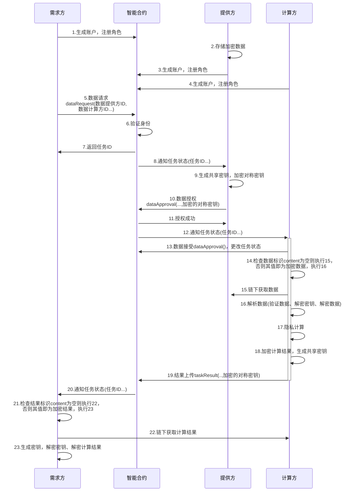
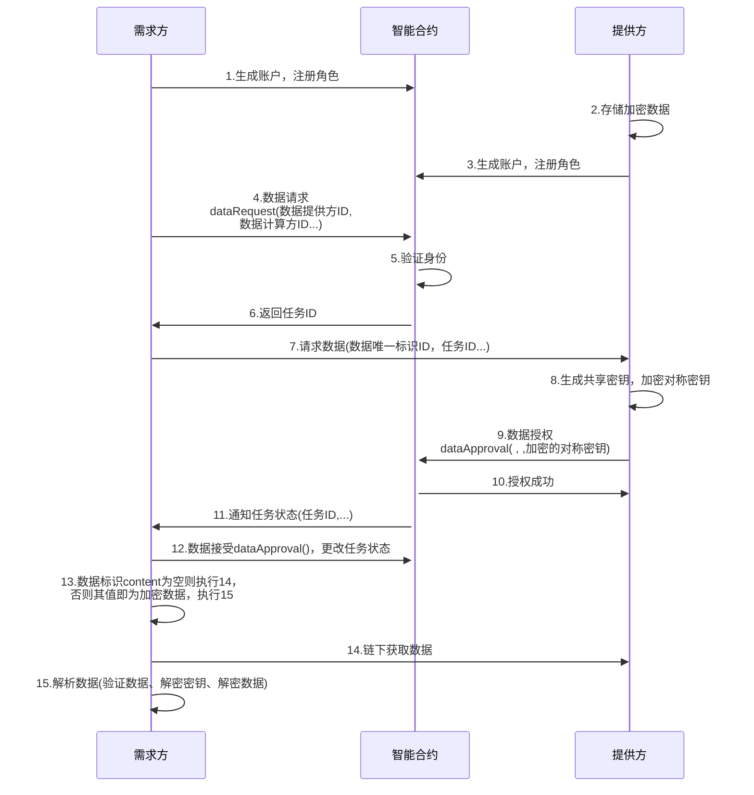

## 1.序言

编号：

类型：标准类--应用规范

标题：星火链网数据加密协议

作者：

发布时间：

状态：

更新时间：

讨论地址：

依赖RFC：

## 2.摘要

本文规范了保护数据隐私的具体流程和协议框架。协议规定了数据需求方、提供方和计算方之间的加密算法及数据格式，采用了对称加密和共享密钥的多层加密机制，以保证数据的隐私和安全。协议还规定了共享密钥的生成和保护方式，以及智能合约查询和解密具体流程。本协议的目的是为实现数据的共享和交换提供保障。

## 3.动机

随着区块链技术的发展和应用的广泛，越来越多的数据需要在区块链上进行存储和处理。然而，由于区块链的公开性和透明性，一些敏感 数据的存储和处理可能会对数据的隐私造成威胁。为了保护隐私，一些加密技术被应用于区块链中，以确保数据的隐私性和安全性。

## 4.规范

### 4.1数据传输流程

- 模式一：数据需求方、数据提供方、数据计算放和智能合约之间链下数据传输流程如下



- 模式二：数据需求方、数据提供方、数据计算放和智能合约之间的数据传输流程如下



### 4.2账户生成

ECDH（Elliptic Curve Diffie-Hellman）是一种密钥交换算法，用于生成共享密钥。它基于椭圆曲线加密算法（ECC），通过私钥和公钥的交换来实现密钥派生。本协议中，参与方节点（需求方、提供方、计算方）使用ECC生成公私钥，交换公钥生成共享密钥，给对称加密密钥加密。生成密钥步骤如下：

1. 选择一个椭圆曲线，例如secp256k1或ed25519，这个椭圆曲线的参数已经被标准化。
2. 随机选择一个私钥r，r必须在曲线的阶n内（即1<=r<n），通常n是一个非常大的素数。
3. 通过椭圆曲线上的点乘法运算，生成公钥R=rG，其中G是椭圆曲线上的一个基点。
4. 将私钥r保密，将公钥R作为自己的身份标识，公开给其他人使用，并将公钥注册到合约中。

### 4.3共享密钥生成

数据提供方和计算方之间、计算方和需求方之间通过ECDH密钥交换算法生成共享密钥，用来给对称密钥进行加密。

#### 4.3.1提供方生成共享密钥

数据提供方的数据经过对称加密，为了保证对称密钥的安全性，规定数据提供方采用共享密钥对对称密钥进行加密，步骤如下：

1. 获取参数。生成共享密钥需要对方的公钥，公钥在用户注册时存储在合约中，提供方通过智能合约查询计算方公钥。

2. 计算数据的共享密钥：

   <center>$K_{data}=sk_{provider}·pk_{TEE}$</center>
                                                                 $K_{data}=sk_{provider}·pk_{TEE}$

   $sk_{provider}$：数据提供方的私钥，$pk_{TEE}$：计算方的公钥

#### 4.3.2计算方生成共享密钥

计算方向智能合约查询数据加密的对称密钥，需要生成共享密钥来解密得到**数据**的对称密钥。为了保证计算结果的安全性，规定计算方用对称加密算法对计算结果加密，生成共享密钥对**计算结果**的对称密钥进行加密。生成共享密钥步骤如下：

1. 获取参数。计算方通过智能合约查询**提供方的公钥**和**需求方的公钥**

2. 计算数据的共享密钥：

   ​                                                                               $K_{data}=sk_{TEE}·pk_{provider}$

3. 计算结果的共享密钥：

   ​                                                                             $K_{result}=sk_{TEE}·pk_{requester}$

   $sk_{TEE}$：计算方的私钥，$pk_{provider}$：提供方的公钥，$pk_{requester}$：需求方的公钥

#### 4.3.3需求方生成共享密钥

需求方向智能合约查询计算结果的加密对称密钥，生成共享密钥来解密得到**计算结果**的对称加密密钥。

1. 获取参数。需求方通过智能合约查询**计算方的公钥**

2. 计算结果的共享密钥：

   ​                                                                            $K_{result}=sk_{requester}·pk_{TEE}$

   $sk_{requester}$：需求方的私钥，$pk_{TEE}$：计算方的公钥。

### 4.4数据加密

为了保证数据和计算结果在传输过程中的隐私性和安全性，规定**数据提供方**在存储数据时使用对称加密算法对数据进行加密，规定**计算方**对计算结果用对称加密算法进行加密。

- 数据提供方和计算方需要选择一个安全的对称加密密钥，用于加密和解密数据，**所使用的对称加密算法在数据标识协议中说明**。
  
- 数据提供方在加密数据后，应在**数据标识**中说明使用的对称加密算法，数据的哈希值和哈希函数等信息，示例如下：
  
  ```json
  {
      "key": "hash",   // 哈希值
      "value": "0x6ff4c67da5435522b34d4007f6902a9366ce7cf5354cc91ee9a7ff12b5892d49",
      "desc": "摘要"
  },
  {
      "key": "HashFunction",   // 哈希函数
      "value": "2"
  },
  {
      "key": "se",    // 对称加密算法
      "value": "1"      
  },
  {
      "key": "content",   // 链上传输
      "value": "xxxxx"    // 加密数据
  }
  ```
  
  对称加密算法可选用如下算法中的一种：
  
  - AES（Advanced Encryption Standard）：AES是一种高强度的对称加密算法，被广泛应用于各种安全场景中。支持128位、192位和256位密钥长度。AES算法基于分组密码，将明文分割成128位的块，并使用密钥对每个块进行加密。AES算法的安全性和强度取决于所选密钥长度，通常使用256位密钥可以提供足够的安全性。
  - 国密对称加密算法：SM4
  - Twofish：Twofish是一种高强度的对称加密算法，支持128位、192位和256位密钥长度。Twofish算法基于分组密码，将明文分割成128位的块，并使用密钥对每个块进行加密。Twofish算法的安全性和强度取决于所选密钥长度。
  - Serpent：Serpent是一种高强度的对称加密算法，支持128位、192位和256位密钥长度。Serpent算法基于分组密码，将明文分割成128位的块，并使用密钥对每个块进行加密。Serpent算法的安全性和强度取决于所选密钥长度。
  - Camellia：Camellia是一种高强度的对称加密算法，支持128位、192位和256位密钥长度。Camellia算法基于分组密码，将明文分割成128位的块，并使用密钥对每个块进行加密。Camellia算法的安全性和强度取决于所选密钥长度。

### 4.5密钥共享：

将加密的对称密钥共享给对方。

#### 4.5.1数据提供方向计算方共享密钥

数据提供方提供的数据经过了对称加密，因此需要将对称密钥共享给计算方。数据提供方采用以下步骤：

1. 加密对称密钥：

   数据提供方使用共享密钥对数据的对称密钥进行加密，公式如下：

   ​                                                                                                 $C_d = E(K_p, K_s)$

   $C_d$：加密的对称密钥，$E$：对称加密，$K_p$：数据的共享密钥，$K_s$：对称加密密钥
   
   只有计算方可以使用其私钥生成共享密钥解密$C_d$，从而获取对称加密密钥$K_s$。
2. 传输加密密钥：

   数据提供方将$C_d$通过智能合约接口存储在合约中。智能合约接口如下：

   ```
   dataApproval(数据提供方ID，计算任务ID，加密的对称密钥);
   ```
   
   `dataApproval`函数的第三个参数即为$C_d$
#### 4.5.2计算方向数据需求节点共享密钥
计算方使用共享密钥对计算结果的对称密钥进行加密，将加密的对称密钥共享给数据需求节点，步骤如下：

1. 加密对称密钥

   计算方使用共享密钥对计算结果的对称密钥进行加密，公式如下：

   ​                                                                                                 $C_r = E(K_r, K_s)$

   $C_r$：加密的对称加密密钥，$E$：对称加密，$K_r$：计算结果的共享密钥，对称加密密钥
   
2. 传输加密密钥

   数据计算方将$C_r$通过智能合约接口存储在合约中。智能合约接口如下：

   ```
   taskResult(计算任务ID，需求方ID，加密的对称密钥)
   ```
   
   `taskResult`函数的第三个参数即为$C_r$


### 4.6密钥获取及数据解密

#### 4.6.1计算方获取加密密钥及解密数据

1. 获取参数。计算方向智能合约查询：加密的对称密钥$C_d$，提供方公钥$pk_{provider}$，数据标识ID等

2. 若数据标识中`content`为空，根据`url`向计算方获取加密数据$data'$。若不为空，则`value`即为加密数据。

3. 验证数据完整性。哈希值和所使用哈希函数在**数据标识**中说明

4. 解密对称加密密钥。用共享密钥对$C_d$进行解密，得到对称加密密钥：

   ​                                                                                             $K_s=D(K_{data},C_d)$

   $D$：对称解密，$K_{data}$：数据的共享密钥

5. 解密数据。数据加密所用对称加密算法在**数据标识**中指出，用密钥$K_s$对加密数据$data'$进行解密，获得**数据**

   ​                                                                                           $data=D(C_d,data')$

#### 4.6.2数据需求方解密计算结果

1. 获取参数。需求方向智能合约查询：加密的对称密钥$C_r$，计算方公钥$pk_{TEE}$，计算结果标识ID等

2. 若计算结果标识中`content`为空，根据`url`向计算方获取加密计算结果$result'$。若不为空，则`value`即为加密计算结果。

3. 验证数据完整性。哈希值和所使用哈希函数在**计算结果标识**中说明

4. 解密对称加密密钥。用计算结果的共享密钥$K_{result}$对加秘密钥$C_r$进行解密，得到对称加密密钥：

   ​                                                                                           $K_s=D(K_{result},C_r)$

5. 解密计算结果。计算结果加密所用对称加密算法在**计算结果标识**中说明，用密钥$K_s$对计算结果$result'$进行解密，获得计算结果：


   ​                                                                                        $result=D(C_r,result')$。

## 5.安全注意事项

- 公钥和私钥的安全性

  在协议中，ECDH密钥交换算法是保证数据传输安全的重要手段之一，因此需要确保公钥和私钥的安全性，防止被非法获取和篡改。

  


